## Datos identificativos del equipo
**Nombre del grupo:** DIU2.almendra 
**Nombre de los autores:** Lorena Castellano Fernández y Daniel Lozano Moya 
**Enlace a GitHub:** https://github.com/daanilm14/DIU/tree/master/P2

## DIU - Practica2, entregables

### Ideación: Mapa de Empatía
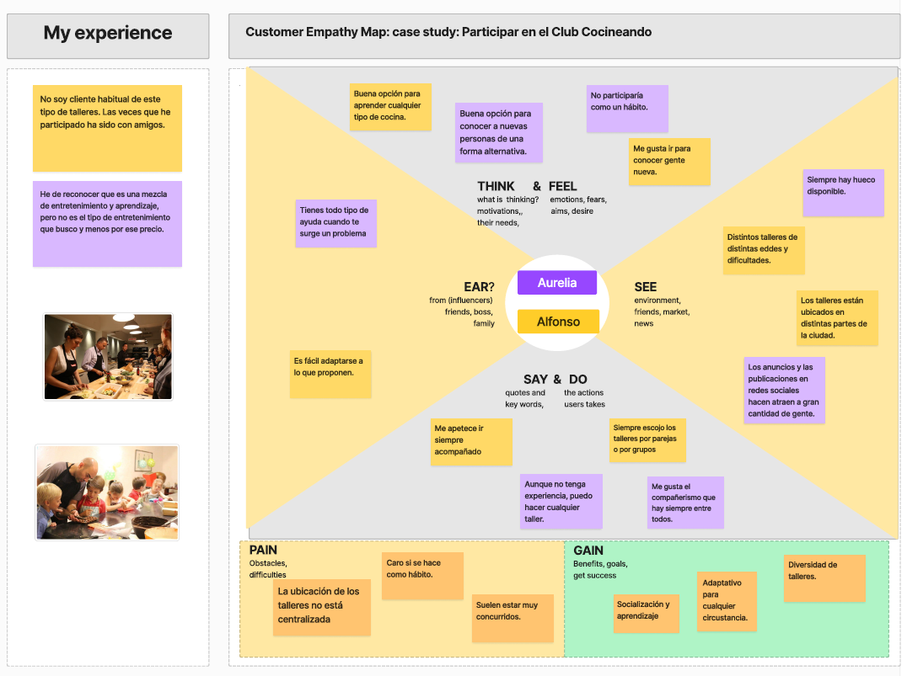

Para hacer el mapa de empatía hemos hecho uso de los usuarios ficticios que diseñamos en la práctica anterior. Hemos asociado a cada uno
un color según su percepción.

### PROPUESTA DE VALOR
Cocineando es una asociación que presenta talleres de cocina de distintos tipos y categorías. Ofrece grandes descuentos y ofertas a cambio
de puntos, que se pueden obtener mediante un sistema de logros. Este sistema hace que los usuarios sean participativos en la web, ya que
los logros incluyen acciones como valorar talleres, compartirlos, desempeñar alguna actividad concreta en algún taller, etc.

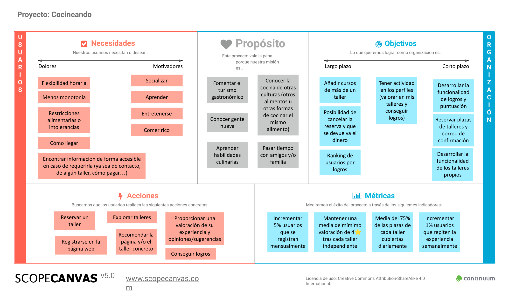

### TASK ANALYSIS

#### User Task Matrix 
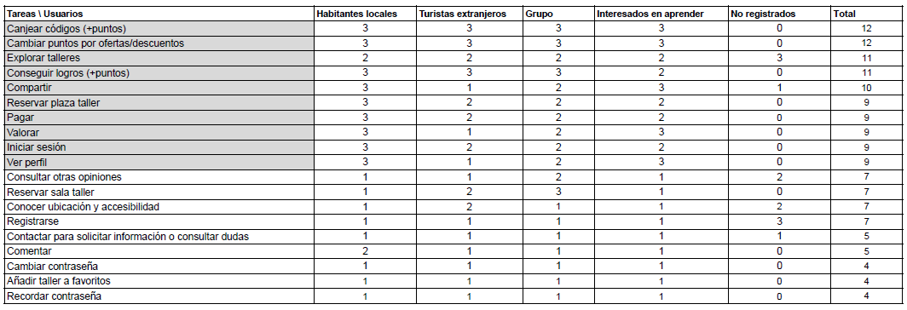

La diferencias entre los distintos tipos de usuarios escogidos para el análisis de tareas son:
- Los habitantes locales se diferencian en que son los usuarios más frecuentes de las actividades.
- Los turistas extranjeros se caracterizan en que en general solo realizan un taller o muy pocos talleres, por lo que no dará continuidad en la realización de estos. Serían el tipo de usuario que más utilizará el código de bienvenida.
- Los grupos se caracterizan en que solo realizan talleres en grupo, ya sea reservando la sala completa para el grupo o ocupando una gran parte de esta.
- Los interesados en aprender se caracterizan en que su objetivo no es el entretenimiento, si no el aprendizaje en la cocina.
- Los usuarios no registrados se pueden diferenciar en usuarios que solo están observando la información ofrecida en la página o futuros usuarios de talleres que se registrarán para participar en los talleres. Destacar también que los usuarios no pertenecientes a dicho tipo de usuario, se tratan de usuarios que se han registrado.

#### User/Task flow
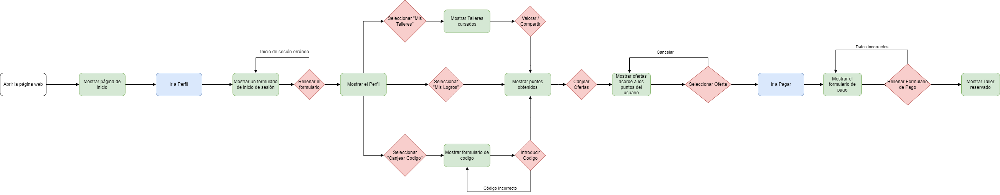

### ARQUITECTURA DE INFORMACIÓN

* Sitemap

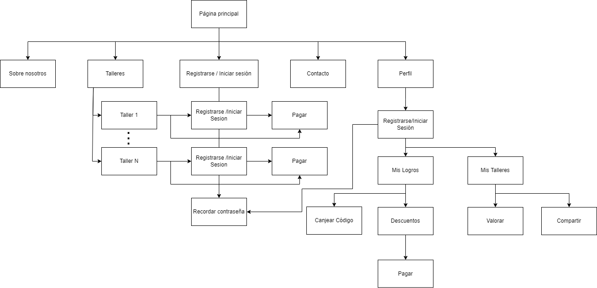

* Labelling

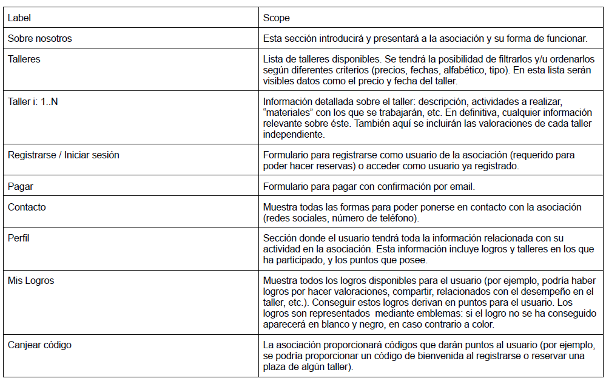
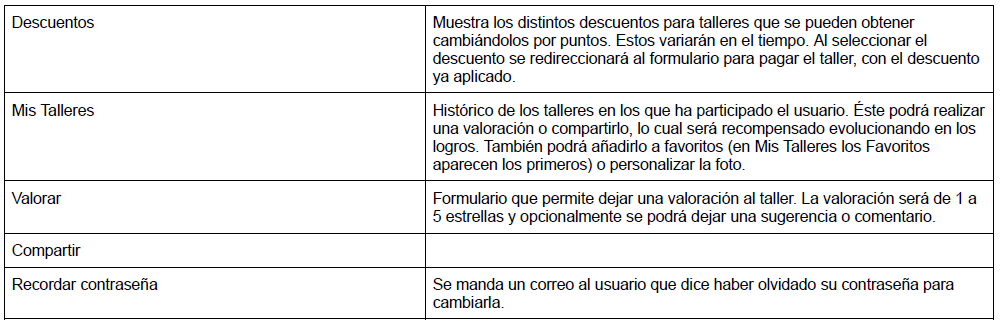

### Prototipo Lo-FI Wireframe 

#### Página de inicio

#### Lista de talleres
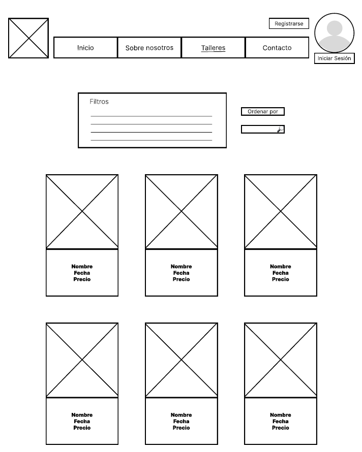

#### Vista de un taller específico
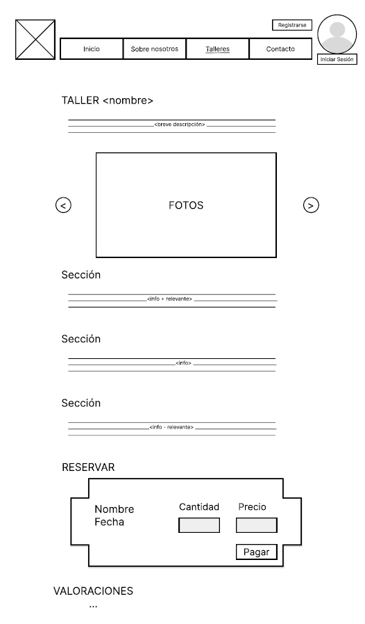

#### Al pulsar en perfil sin haber iniciado sesión
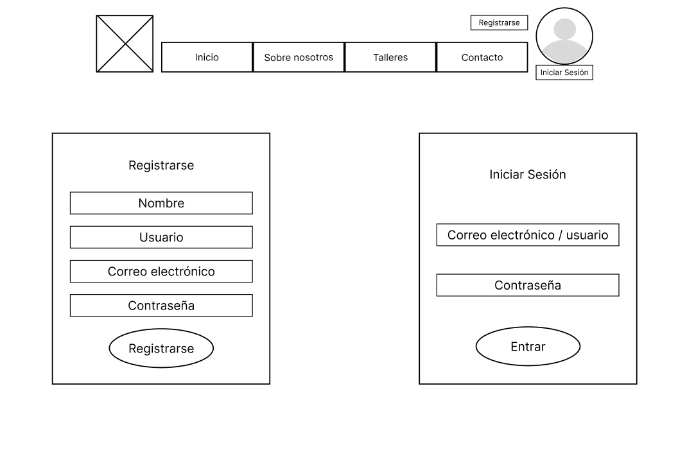

#### Mis logros
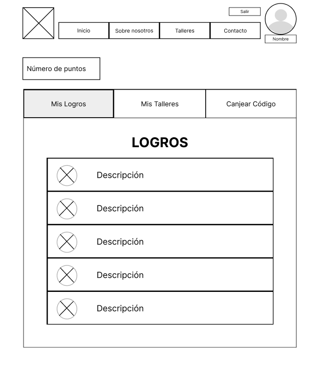

#### Mis Talleres
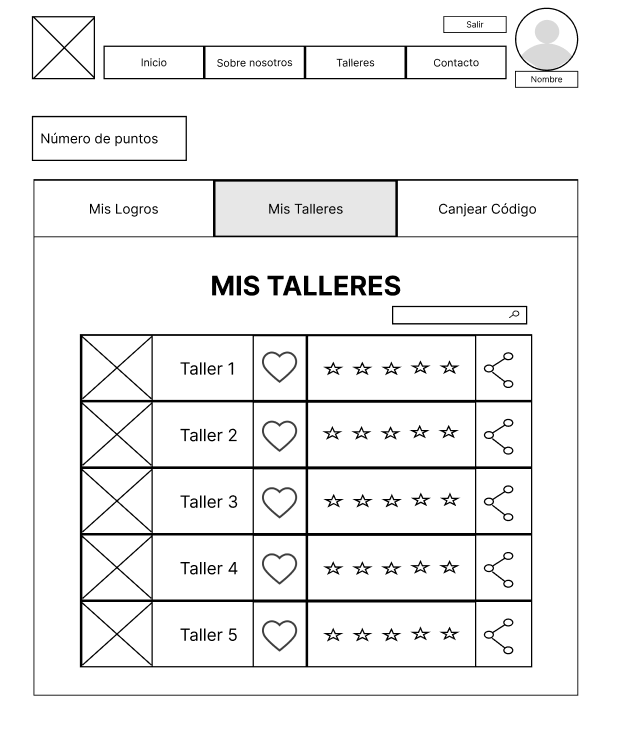

#### Boceto responsive
[Lista de Talleres](BocetoBreakpoint.mp4)

### Conclusiones  
Las herramientas empleadas establecen una base sobre la que trabajar, enfocada en el usuario y ofreciendo una guía clara para fortalecer la diferenciación (= propuesta de valor). Sin embargo, a medida que se avanza, surgen nuevas ideas y se identifican contradicciones que requieren solución. A pesar de ello, al final del proceso, la base acaba siendo considerablemente sólida.
