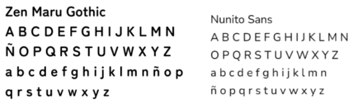
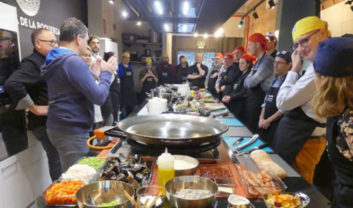
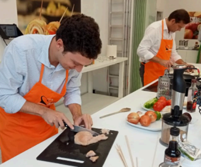
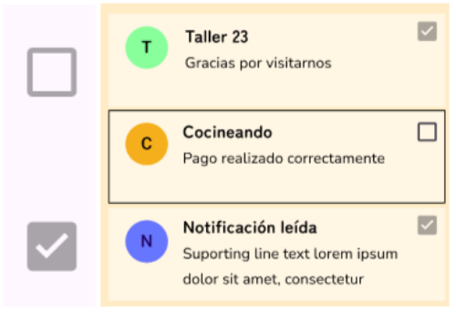

## Datos identificativos del equipo
**Nombre del grupo:** DIU2.almendra 
**Nombre de los autores:** Lorena Castellano Fernández y Daniel Lozano Moya 
**Enlace a GitHub:** https://github.com/daanilm14/DIU/tree/master/P2

## DIU - Practica3, entregables

## Moodboard (diseño visual + logotipo)

### Estrategia de marca
Nuestro club de cocina está dedicado a explorar la cocina de otras culturas (otros alimentos u otras formas de cocinar el mismo alimento),
promoviendo la gastronomía y acentuando la creatividad de forma didáctica y sociable.
Presentamos talleres de cocina de distintos tipos y categorías, además de grandes descuentos y ofertas a cambio de puntos, que se pueden
obtener mediante un sistema de logros. Este sistema hace que los usuarios sean participativos en la web, ya que los logros incluyen acciones
como valorar talleres, compartirlos, desempeñar alguna actividad concreta en algún taller, etc.

### Logo y estilo

Para el estilo hemos decidido que debe transmitir chispa y dinamicidad, para que transmita el mensaje de que “no es un muermo”.
Además, debe relacionarse instantáneamente con la cocina, y simple (sin muchos elementos) para que sea memorable.

### Eslogan

El lenguaje que usamos busca resaltar la importancia de conectar con el momento (taller y
compañeros), olvidando las preocupaciones en ese instante, mientras se disfruta de la
cocina, se aprenden distintas culturas gastronómicas y se explora la creatividad culinaria.

### Paleta de color

Para el color hemos escogido anaranjado por representar muchas de las características que
queremos transmitir: energía, vitalidad, diversión y calidez.
Con este, hemos hecho un esquema de colores análogos.

### Tipografía

Para nuestros materiales, elegimos dos tipografías que reflejen el mensaje que se quiere transmitir.
- ‘Zen Maru Gothic', una tipografía redonda, con forma suave, utilizada para transmitir cercanía y ambientes relajados y amigables. Esta fuente
se utiliza siempre en bold y para títulos o acciones (como botones), y según la sección se encuentra en tamaños 32, 22, 20 y 16.
- ‘Nunito Sans', una fuente legible, versátil y atractiva, además de casar con la anterior en ser redonda. Esta fuente se utiliza mayormente en
regular y para texto, salvo casos puntuales en bold o extralight, y según la sección se encuentra en tamaños 25, 20, 18, 14 o 12.

### Nuestras imágenes

Una fase de nociones en la que se cocina a la par que el profesional que imparte el taller y se explican los conceptos específicos de la
categoría del taller.

La fase en que ya con las nociones dadas cada participante hace su creación (se puede trabajar como se quiera: tanto individualmente
como en grupos).

### Diseño de inspiración
Nos hemos inspirado en tres logos para crear el nuestro:

### Iconos

## Landing Page
[Landing Page](LandingPage.pdf)

## Mockup: LAYOUT HI-FI

### Guidelines
Para realizar el prototipo hemos utilizado Material-3-Design-Kit de Figma, adaptándolos a lo que nos interesaba. Se han usado dos imágenes
de muestra.

- Onboarding: hemos realizado una breve introducción a nuestra app.

- Menu (navBar adaptada a móvil): hemos adaptado la barra de 3 elementos de “navigation bars” del kit.

- Hero image + Carousel: hemos adaptado el Hero de “Carousel” del kit. En nuestro caso ya habíamos hecho los bocetos con botones en lugar de un Carousel, por lo que hemos dejado donde iría la Hero image y hemos añadido los botones.

- Search: hemos adaptado la barra de “Search” del kit.

- Wizards (explain process): hemos incluído dos pasos para que, si quiere el usuario, seamos nosotros los que nos pongamos en contacto con él.

- Article List 5-7 Card items: hemos adaptado una de las listas de “List” del kit.

- Item details + actions: hemos utilizado casillas de “Ckeckboxes” del kit para marcar notificaciones como leídas.

-  Reserva: para reservar se clica en el taller de interés, se selecciona una cantidad de tickets y se le da a pagar. En caso de que el usuario haya entrado sin registrarse se redirigirá a la página de identificación, y en otro caso al pago. Tras procesar el pago se informará del resultado de la operación y se enviará la confirmación en la notificación.

- Form Input: para los formularios hemos adaptado los campos de “Text Fields” del kit.

- Shopping cart: desde el principio decidimos no tener carrito.

- About: en el about hemos descrito nuestra misión y oferta.

### Layout
En nuestro caso hay acciones que hacen que haya más o menos notificaciones, habiendo varias imágenes similares siendo la base la misma,
por lo que en la memoria solo se incluirán las imágenes con 2 notificaciones. En el enlace a Figma y/o la simulación queda más claro a lo que
se está haciendo referencia.
DESCARGARLO PARA QUE SE VEA BIEN.
[Layout](Layout.pdf)

### Enlace a Figma
[Figma](https://www.figma.com/design/GoNJfttakMX64HKaiYQUTE/Cocineando-Layout?node-id=54795%3A26369&t=C5Vd4jfO7TYCfvJ2-1)

### Muestra de simulación
Para la muestra en primer lugar hemos realizado acciones sin identificarse, para mostrar lo que se puede realizar y lo que no sin registrarse (en las acciones que no se pueden realizar te lleva a la pantalla de registrarte) y después iniciando sesión (registrándose ocurre lo mismo).
[Simulación](Simulacion.mp4)

### Conclusiones  
Nos ha parecido la práctica más entretenida con diferencia, y es con la que más hemos aprendido la utilidad de Figma. Nos parece muy interesante la sencillez con la que se pueden realizar las simulaciones una vez se tienen los frames.
