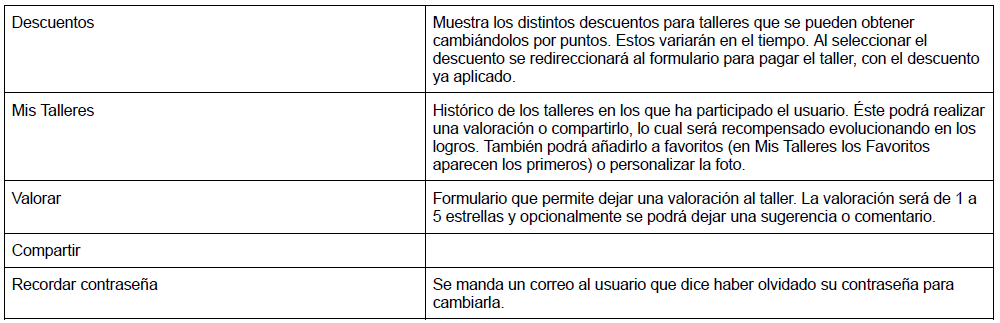
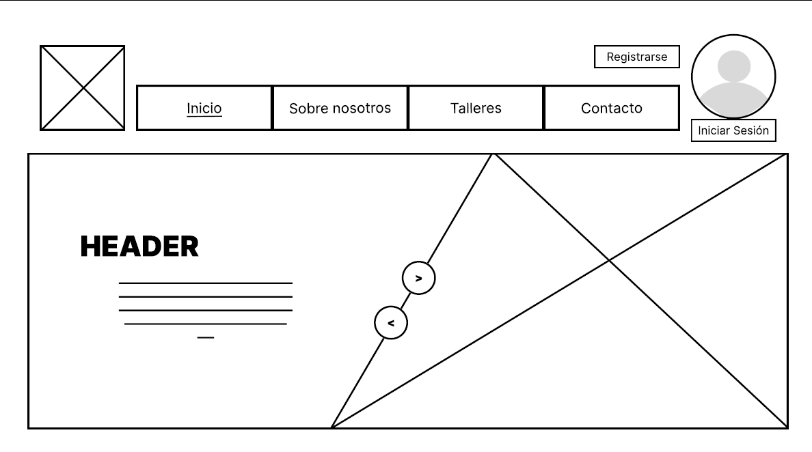
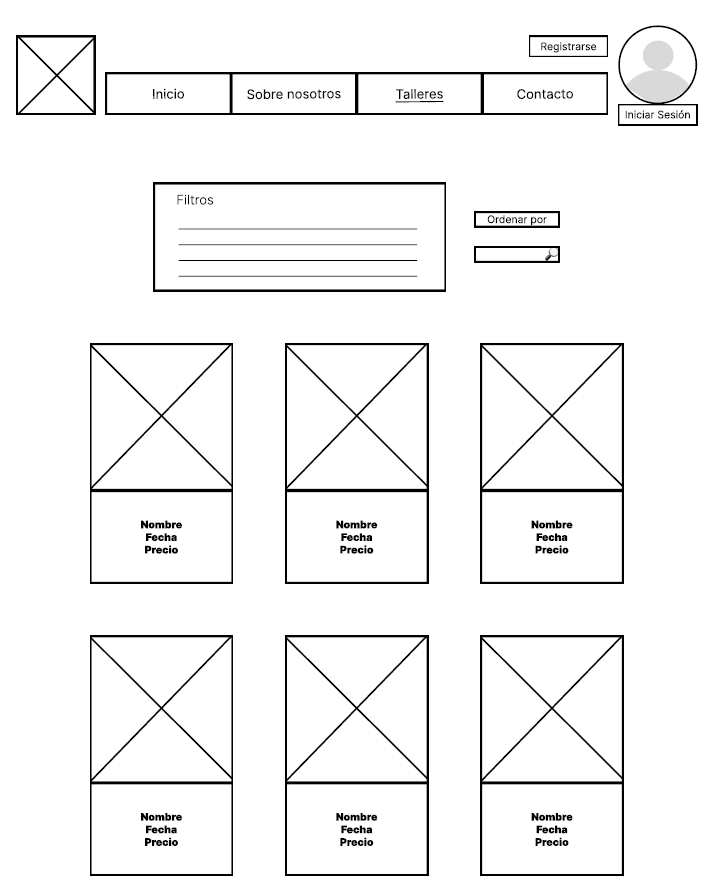
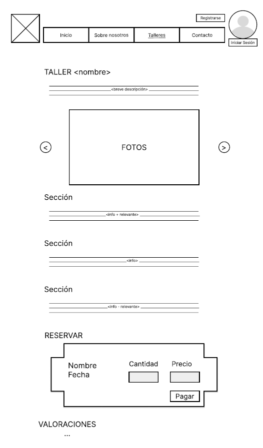
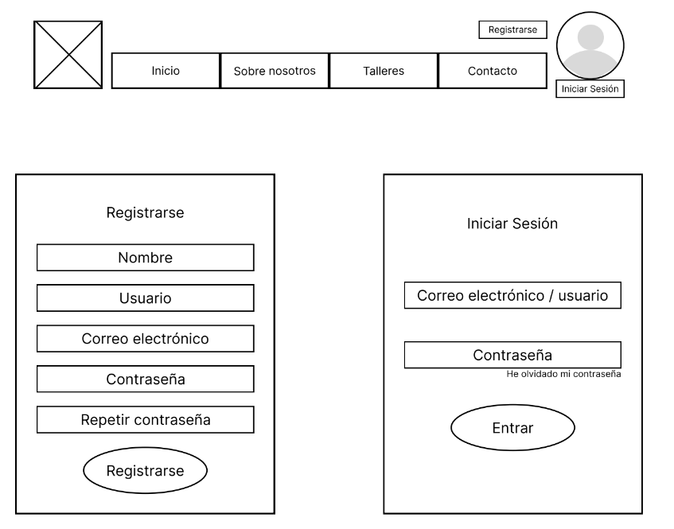
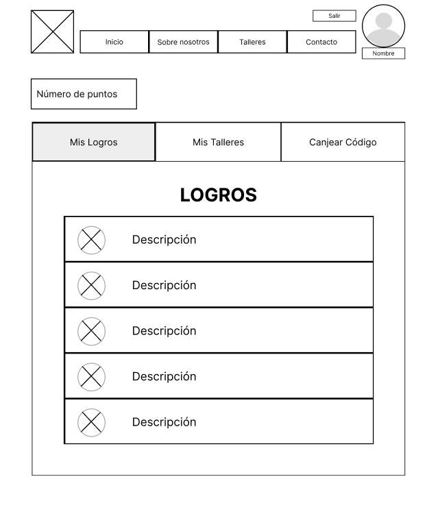
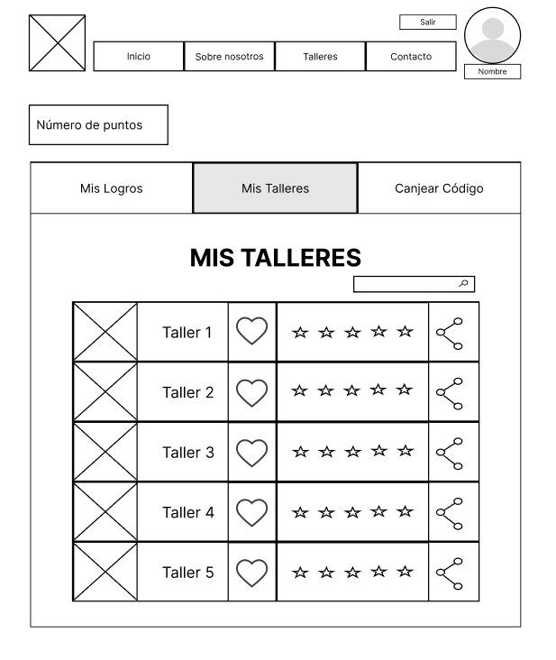

# DIU24
Prácticas Diseño Interfaces de Usuario 2023-24 (Tema: Gastronomía ) 

Grupo: DIU2_almendra.  Curso: 2023/24 
Updated: 19/5/2024

Proyecto: 
>>> COCINEANDO 

Descripción: 

>>> Cocineando es una asociación que presenta talleres de cocina de distintos tipos y categorías. Ofrece grandes descuentos y ofertas a cambio de puntos, que se pueden obtener mediante un sistema de logros. Este sistema hace que los usuarios sean participativos en la web, ya que los logros incluyen acciones como valorar talleres, compartirlos, desempeñar alguna actividad concreta en algún taller, etc.

Logotipo: 
>>> 

Miembros
 * :bust_in_silhouette:   Lorena Castellano Fernández     :octocat:     
 * :bust_in_silhouette:  Daniel Lozano Moya     :octocat:

----- 

# Proceso de Diseño 

## Paso 1. UX User & Desk Research & Analisis 

 **1.a User Reseach Plan**
-----

### Perfiles de usuario
- Turistas extranjeros que viajen a la ciudad, que les guste la cocina y tengan interés en
aprender nuevas culturas culinarias. Debido a que sería una buena opción de promover la
gastronomía local y hacer que los extranjeros aprendan de la cocina típica de la ciudad.
- Habitantes locales que tengan interés en ampliar su sabiduría culinaria, haciendo uso de
talleres que ofrezcan un tipo de cocina que no es común a la ciudad en la que se encuentran.
- Niños y adolescentes con poco conocimiento acerca de la cocina, que tengan intención de
mejorar sus habilidades dentro de la cocina haciendo uso de talleres de distintos niveles de
habilidad.
- Cualquier persona que tenga intención de pasar un buen rato y conocer nuevas personas
haciendo actividades grupales como puede ser la cocina.

### Conclusion
Factores importantes en esta búsqueda son la importancia de incentivar la motivación y
participación en las actividades, la estrecha relación entre la calidad de la experiencia
gastronómica y el valor percibido y la facilidad de uso y capacidad de captar la atención de
las aplicaciones y/o servicios web relacionados con la planificación de las actividades.
Se identifican perfiles que se pueden encontrar en cualquier rango de edad y nacionalidad,
pudiendo aprovechar la oportunidad de captar usuarios de diversos intereses y estableciendo
distintas temáticas y tipos de actividades gastronómicas. 

 1.b Competitive Analysis
-----

**Leyenda:** ✅ Bien    ❔ Regular      ❌ Mal

### Competidor elegido y justificación
**Competidor #1 PilsaEduca:** el modelo de negocio no es el que se persigue y el pago
y redirecciones no son cómodas. Como puntos positivos los talleres están
correctamente detallados y poseen una sección de comentarios, además de que se
puede acceder como usuario.

**Competidor #2 EspaiGranada:** no se puede acceder como usuario y no se dispone
de sección de comentarios. Como puntos positivos el modelo de negocio no se
aleja demasiado al que se persigue, los talleres están correctamente detallados y no
hay tanto exceso de redirecciones.

**Competidor #3 BernarditaCocina:** el modelo de negocio no es el que se persigue,
los talleres solo poseen la información básica (no una descripción suficiente) y no
hay acceso como usuario. El único punto positivo a destacar con respecto al resto
es que tecnológicamente es mejor que el resto.

**Elección:** El competidor elegido ha sido #2 Espai Granada, ya que es el que menos puntos
negativos ha obtenido en relación con las características de evaluación, y se ha de
superar al mejor.

 1.c Persona
-----

### Persona 1: Alfonso David Sánchez

 
Se ha elegido esta persona porque parece una persona normal, sin interés relacionado en
la gastronomía pero que, tras una vida monótona surge un cambio en su vida que le motiva
a realizar otras actividades como viajar, provocando esto que inicie su interés en usar
páginas de actividades gastronómicas.

### Persona 2: Aurelia Gómez Pérez

 
El motivo de la elección de esta persona es que cubre las características de, en un
principio no tener ningún interés relacionado con la cocina, pero un evento principal
(la maternidad) combinado con sus intereses (vida social) y preocupaciones
(aislamiento), la llevan a interesarse por una página de actividades gastronómicas
que le aparece en recomendados. 

 1.d User Journey Map
----

Ambas situaciones a continuación las consideramos habituales:

**Persona 1: Alfonso David Sánchez** 
Ha escogido [EspaiGranada](https://www.espaigranada.com/) debido a que de todos los que aparecían, era el que más se ajustaba a su nivel adquisitivo según la calidad/precio.

**Persona 2: Aurelia Gómez Pérez** 
Elige [EspaiGranada](https://www.espaigranada.com/) porque le aparece en recomendaciones, se ve un sitio
profesional, aparece la información detallada y hay muchas alternativas.

 1.e Usability Review
----

[Usability Review](P1/Usability%20Review.pdf) **Valoración final:** 80 - Good

**Comentario sobre la valoración:** se obtiene una buena valoración, pero lo que hace que la puntuación no sea mejor son cuestiones muy importantes (principalmente que la navegación es confusa y que no hay posibilidad de buscar/filtrar ni registrarse para una experiencia personalizada o guardar el progreso).

## Paso 2. UX Design  

 2.a Reframing / IDEACION: Empathy map 
----

Para hacer el mapa de empatía hemos hecho uso de los usuarios ficticios que diseñamos en la práctica anterior. Hemos asociado a cada uno un color según su percepción.
  
**Propuesta de valor:**  Cocineando es una asociación que presenta talleres de cocina de distintos tipos y categorías. Ofrece grandes descuentos y ofertas a cambio de puntos, que se pueden obtener mediante un sistema de logros. Este sistema hace que los usuarios sean participativos en la web, ya que los logros incluyen acciones como valorar talleres, compartirlos, desempeñar alguna actividad concreta en algún taller, etc.

 2.b ScopeCanvas
----

 2.b User Flow (task) analysis 
-----

>>> Definir task analysis y user flow
#### Task Analysis 

La diferencias entre los distintos tipos de usuarios escogidos para el análisis de tareas son:
- Los habitantes locales se diferencian en que son los usuarios más frecuentes de las actividades.
- Los turistas extranjeros se caracterizan en que en general solo realizan un taller o muy pocos talleres, por lo que no dará continuidad en la realización de estos. Serían el tipo de usuario que más utilizará el código de bienvenida.
- Los grupos se caracterizan en que solo realizan talleres en grupo, ya sea reservando la sala completa para el grupo o ocupando una gran parte de esta.
- Los interesados en aprender se caracterizan en que su objetivo no es el entretenimiento, si no el aprendizaje en la cocina.
- Los usuarios no registrados se pueden diferenciar en usuarios que solo están observando la información ofrecida en la página o futuros usuarios de talleres que se registrarán para participar en los talleres. Destacar también que los usuarios no pertenecientes a dicho tipo de usuario, se tratan de usuarios que se han registrado.

#### User/Task flow

 2.c IA: Sitemap + Labelling 
----

* Sitemap

* Labelling

 2.d Wireframes
-----

#### Página de inicio

#### Lista de talleres

#### Vista de un taller específico

#### Al pulsar en perfil sin haber iniciado sesión

#### Mis logros

#### Mis Talleres

#### Enlace a boceto responsive
[Lista de Talleres](P2/BocetoBreakpoint.mp4)

## Paso 3. Mi UX-Case Study (diseño)

 3.a Moodboard
-----

>>> Plantear Diseño visual con una guía de estilos visual (moodboard) 
>>> Incluir Logotipo
>>> Si diseña un logotipo, explique la herramienta utilizada y la resolución empleada. ¿Puede usar esta imagen como cabecera de Twitter, por ejemplo, o necesita otra?

  3.b Landing Page
----

>>> Plantear Landing Page 

 3.c Guidelines
----

>>> Estudio de Guidelines y Patrones IU a usar 
>>> Tras documentarse, muestre las deciones tomadas sobre Patrones IU a usar para la fase siguiente de prototipado. 

  3.d Mockup
----

>>> Layout: Mockup / prototipo HTML  (que permita simular tareas con estilo de IU seleccionado)

 3.e ¿My UX-Case Study?
-----

>>> Publicar my Case Study en Github..
>>> Documente y resuma el diseño de su producto

## Paso 5. Exportación & evaluación con Eye Tracking 

Exportación a HTML/Flutter
-----

)  5.b Eye Tracking method 

>>> Indica cómo diseñas experimento y reclutas usuarios (uso de gazerecorder.com)  

Diseño del experimento 
----

>> Uso de imágenes (preferentemente) -> hay que esablecer una duración de visualización y  
>> fijar las áreas de interes (AoI) antes del diseño. Planificar qué tarea debe hacer el usuario (buscar, comprar...) 

  
>> cambiar img por tu diseño de experimento  

>> Recordar que gazerecorder es una versión de pruebas: usar sólo con 3 usuarios para generar mapa de calor (recordar que crédito > 0 para que funcione) 

Resultados y valoración 
-----

>> Cambiar por tus resultados
  

## Paso 4. Evaluación 

 4.a Caso asignado
----

>>> Breve descripción del caso asignado con enlace a  su repositorio Github

 4.b User Testing
----

>>> Seleccione 4 personas ficticias. Exprese las ideas de posibles situaciones conflictivas de esa persona en las propuestas evaluadas. Asigne dos a Caso A y 2 al caso B
 

| Usuarios | Sexo/Edad     | Ocupación   |  Exp.TIC    | Personalidad | Plataforma | TestA/B
| ------------- | -------- | ----------- | ----------- | -----------  | ---------- | ----
| User1's name  | H / 18   | Estudiante  | Media       | Introvertido | Web.       | A 
| User2's name  | H / 18   | Estudiante  | Media       | Timido       | Web        | A 
| User3's name  | M / 35   | Abogado     | Baja        | Emocional    | móvil      | B 
| User4's name  | H / 18   | Estudiante  | Media       | Racional     | Web        | B 

 4.c Cuestionario SUS
----

>>> Usaremos el **Cuestionario SUS** para valorar la satisfacción de cada usuario con el diseño (A/B) realizado. Para ello usamos la [hoja de cálculo](https://github.com/mgea/DIU19/blob/master/Cuestionario%20SUS%20DIU.xlsx) para calcular resultados sigiendo las pautas para usar la escala SUS e interpretar los resultados
http://usabilitygeek.com/how-to-use-the-system-usability-scale-sus-to-evaluate-the-usability-of-your-website/)
Para más información, consultar aquí sobre la [metodología SUS](https://cui.unige.ch/isi/icle-wiki/_media/ipm:test-suschapt.pdf)

>>> Adjuntar captura de imagen con los resultados + Valoración personal 

 4.d Usability Report
----

>> Añadir report de usabilidad para práctica B (la de los compañeros)

>>> Valoración personal 

5.) Conclusion de EVALUACION (A/B testing + usability report + eye tracking) 
----

>> recupera el usability report de tu práctica (que es el caso B de los asignados a otros grupos) 
>> con los resultados del A/B testing, de eye tracking y del usability report:
>>  comentad en 2-3 parrafos cual es la conclusion acerca de la realización de la práctica y su evaluación con esas técnicas y que habéis aprendido

## Conclusión final / Valoración de las prácticas

>>> (90-150 palabras) Opinión FINAL del proceso de desarrollo de diseño siguiendo metodología UX y valoración (positiva /negativa) de los resultados obtenidos  

